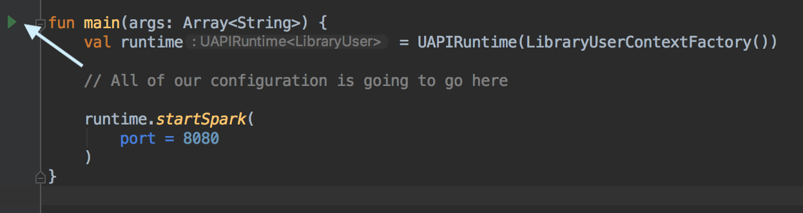

Since we're building our example to run inside of an embedded microservice framework like Spark, we get to write
something that you may not have seen in a very long time - a `main` method!

Create a file named `src/main/kotlin/LibraryApp.kt` - this will be the entrypoint for your application! You'll
notice we're putting it in the root package - that's to make it easier to reference when we actually want to run
the application.

```kotlin
import edu.byu.uapi.http.spark.startSpark
import edu.byu.uapi.server.UAPIRuntime

fun main(args: Array<String>) {
  val runtime = UAPIRuntime()
  
  // All of our configuration is going to go here
  
  runtime.startSpark(
    port = 8080
  )
}

```

This will start a Spark embedded server on port 8080.

But wait!  Your IDE is probably lighting up with red squiggly error lines right now! That's because we
need to provide our Runtime instance with a way to handle user authentication and authorization.

We'll explain what we're doing here in the [next lesson](./user-context.md), but for now, let's just stub out the interfaces
that the Runtime wants.

Create a file named `src/main/kotlin/edu/byu/uapi/library/LibraryUser.kt`:

```kotlin
package edu.byu.uapi.library

import edu.byu.uapi.server.UserContextAuthnInfo
import edu.byu.uapi.server.UserContextFactory
import edu.byu.uapi.server.UserContextResult

class LibraryUser

class LibraryUserContextFactory: UserContextFactory<LibraryUser> {
    override fun createUserContext(
        authenticationInfo: UserContextAuthnInfo
    ): UserContextResult<LibraryUser> {
        TODO("not implemented")
    }
}
```

Now, you can fix your main class:

```kotlin
fun main(args: Array<String>) {
  val runtime = UAPIRuntime(LibraryUserContextFactory())
  
  // All of our configuration is going to go here
  
  runtime.startSpark(
    port = 8080
  )
}
```

Hooray! The red squigglies have been banished!

Now, let's make it so that Maven can run our application.  Add the follwing to the `<plugins>` section of your POM:

```xml
<plugin>
    <groupId>org.codehaus.mojo</groupId>
    <artifactId>exec-maven-plugin</artifactId>
    <version>1.6.0</version>
    <configuration>
        <mainClass>LibraryAppKt</mainClass>
    </configuration>
</plugin>
```

Now, you can run your application with `mvn compile exec:java`. Right now, it will fail to run, as the runtime
will detect that you haven't defined any resources and raise an error (as opposed to failing silently).

> Up-front resource validation hasn't been implemented yet, so this won't actually throw an error yet.
{: .callout-in-progress }

You can also set up a run configuration in your IDE. If you're using IntelliJ, look for the 'run' icon
in your main class:



Now, let's learn about that `UserContextFactory` we stubbed out!

