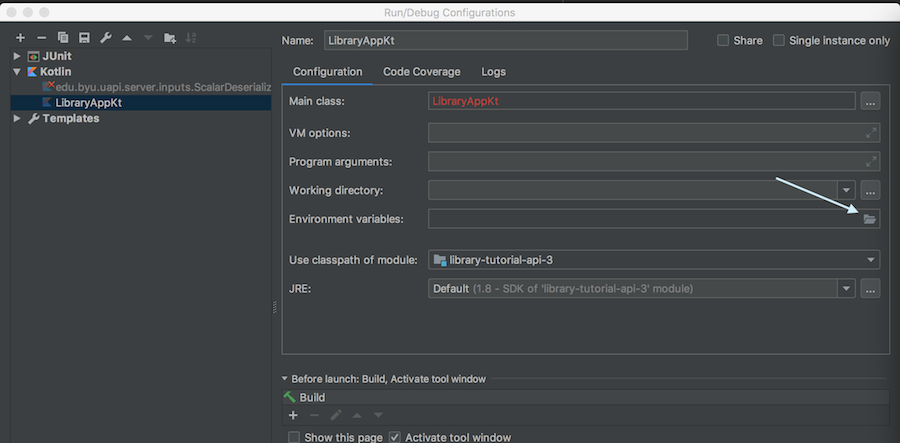

The UAPI Runtime tries to bake authorization and permissions-checking into all levels of the application.
This allows us to make things easier both for you and those who call your API. For example, the
user can know that, if we send back a link to an operation, the logged-in user is authorized to follow that link.
We can also make enforcing these rules easy for you.

In order to facilitate this authorization checking, we require you to define a 'User Context' class.
As you will soon see, instances of this class will be used by every operation to help us make authorization decisions.

A 'User Context' can be any class you want - you can decide what works best for you! You just have to tell the UAPIRuntime
how to construct one. You do this by passing an instance of `UserContextFactory` to the runtime when you create it.


## The User Context object

Your user context class can contain anything you want. Ideally, you should be able to determine if a user is authorized
to perform an action on a record using nothing but data contained in the user context and in the record itself.

Let's make your Library User class contain a few simple values:

```kotlin

class LibraryUser(
  val netId: String,
  val cardholderId: Int?,
  val isLibrarian: Boolean
) {
    val isCardholder = cardholderId != null
}

```

This should be enough information to make most of our decisions - the caller can be a cardholder, they can be a librarian,
or they can be neither.

As we further develop our application, we'll be returning to this class to add methods which actually make authentication
decisions based on the information we've included.



Authorization decisions often include I/O calls, either to a database or an API. If there are such calls that are slow
or computationally expensive, you may want to delay making those calls until the first time you need the result. 
One easy way to do so is to use the Kotlin `lazy` property delegate:

```kotlin

class MyUserContext(
  val userId: String,
  slowClient: SlowApiClient
) {
  val isAdmin: Boolean by lazy {
    slowClient.isAdmin(this.userId)
  }
}

```

This will ensure that the expensive call only happens when needed, and only happens once.

You may also need to explore keeping a longer-duration cache in place, so that we don't have to make this call on every
single request.




## UserContextFactory

`UserContextFactory` defines one method: `createUserContext`. This accepts a `UserContextAuthnInfo` object which contains
details about the incoming request:

Field           | Type                      | Description
----------------|---------------------------|-------------
headers         | Map<String, Set<String>>  | HTTP request headers
queryParams     | Map<String, Set<String>>  | HTTP Query Params
requestUrl      | String                    | Full request URL
relativePath    | String                    | Path within the API
remoteIp        | String                    | Client's IP address

Over time, more fields may be added as they are needed.

`createUserContext` returns an instance of UserContextResult. This is a class which can be one of two types: `UserContextResult.Success`
and `UserContextResult.Failure`. `Success` simply wraps an instance of your chose User Context class, and `Failure` wraps
one or more strings describing the error.

If you are performing any operations inside of your factory that might throw an exception, you should catch the exception
and wrap it in a `Failure` object. This allows the UAPI Runtime to construct a well-formatted error body to send to the
client.


Be careful not to include any user inputs (such as the value of a header) in the `Failure` messages! Doing so has been the root cause of high-profile security breaches.



## Implementing a UserContextFactory

Let's move on to actually implementing a simple factory!

Most of our APIs are called through WSO2. WSO2 tells us about the user's credentials using 
[JSON Web Tokens (JWTs)](https://developer.byu.edu/docs/design-api/byu-usage-json-web-token) passed in HTTP headers. 
Because this is a common pattern, we offer a base UserContextFactory that parses and validates those JWTs for us.

In order to use it, you will first need to add the following dependency to your pom.xml:

```xml
<dependency>
  <groupId>edu.byu.uapi.kotlin.utilities</groupId>
  <artifactId>jwt-extensions</artifactId>
</dependency>
```

Now, let's modify your LibraryUserContextFactory to extend from this base class:

```kotlin
class LibraryUserContextFactory: JwtUserContextFactory<LibraryUser>() {
    override fun createUserContext(
        authenticationInfo: UserContextAuthnInfo,
        currentJwt: ByuJwt,
        originalJwt: ByuJwt?
    ): UserContextResult<LibraryUser> {
        TODO("not implemented")
    }
}
```

The base class will take care of extracting the passed JWTs from the HTTP headers and validating them.
It uses the [byu-jwt-java](https://github.com/byu-oit/byu-jwt-java) library to do so.

If there are no JWT headers, or the JWTs are invalid, the base class will return an error. By the time
it calls into your code, you can know that the JWTs are present and valid.

The `currentJwt` contains the JWT that was passed to your service from WSO2. The `originalJwt`
is optional, and contains the 'original' JWT that is passed to you from the client. For an explanation
of the difference between the two, read the TODO: Docs Link


If you need to customize how the JWT validation happens (for example, to accept JWTs from
an issuer besides WSO2), you can pass an instance of [`ByuJwtValidator`](https://byu-oit.github.io/byu-jwt-java/) to 
the `JwtUserContextFactory`.




To make things easy for you, we're going to cheat a bit and make your list of Librarian users be a simple hard-coded list,
so that you can access your API without having to figure out how to modify the database. This is definitely *NOT* something
you should do in a real application.



Put your NetId into a set called `librarianNetIds`:

```kotlin
private val librarianNetIds = setOf("{your netId here}")
```

Now, let's use the `currentJwt` to get the caller's Net Id.  Note that there may not be a logged-in user - this might be a
system calling us! In that case, we'll include the system's organization identity. If we still don't have a net ID,
then we'll send back a failure. Then, we'll ask our Library app layer
for the cardholder ID associated with that netId and check our `librarianNetIds` set for the provided NetId:

```kotlin
    override fun createUserContext(
        authenticationInfo: UserContextAuthnInfo,
        currentJwt: ByuJwt,
        originalJwt: ByuJwt?
    ): UserContextResult<LibraryUser> {
       val netId = currentJwt.resourceOwnerClaims?.netId ?: currentJwt.clientClaims.netId
      
       if (netId == null) {
           return UserContextResult.Failure("No NetID was provided.")
       }
       
       val cardholderId = Library.getCardholderIdForNetId(netId)
       
       return UserContextResult.Success(LibraryUser(
           netId = netId,
           cardholderId = cardholderId,
           isLibrarian = librarianNetIds.contains(netId)
       )) 
    }
```

Now, we have a `UserContextFactory` that can actually create a user context!

## Local Testing

If you've developed APIs that consume JWTs before, you may be thinking to yourself "But what about running this locally!
Getting a valid JWT isn't easy!"

In order to make this easier, we've provided a `UserContextFactory` that can wrap another and will automatically turn
a valid, WSO2-issued OAuth Bearer Token into a JWT, ready for consumption by your `UserContextFactory`:
`OnlyUseOnYourPersonalDevMachineBearerTokenUserContextFactory`. As its name implies, this is ONLY for use in local,
on-your-laptop development, and should not be used on any kind of real server.

Let's modify our `LibraryApp` to look for a system property or environment variable called 'ENV' and, if it is equal to 'local', 
use the bearer token factory:

```kotlin

//Look for system property or environment variable named 'ENV'
private val environment = System.getProperty("ENV") ?: System.getenv("ENV") ?: "production"
private val isLocalDevelopment = environment == "local"

fun main(args: Array<String>) {
    val libraryUserFactory = LibraryUserContextFactory()

    val actualUserFactory = if (isLocalDevelopment) {
        OnlyUseOnYourPersonalDevMachineBearerTokenUserContextFactory(libraryUserFactory)
    } else {
        libraryUserFactory
    }

    val runtime = UAPIRuntime(actualUserFactory)

    // All of our configuration is going to go here

    runtime.startSpark(
        port = 8080
    )
}
```

Now, let's make sure the environment variable gets set when we run with Maven:

```xml
<plugin>
    <groupId>org.codehaus.mojo</groupId>
    <artifactId>exec-maven-plugin</artifactId>
    <version>1.6.0</version>
    <configuration>
        <mainClass>LibraryAppKt</mainClass>
        
        <systemProperties>
            <systemProperty>
                <key>ENV</key>
                <value>local</value>
            </systemProperty>
        </systemProperties>
        
    </configuration>
</plugin>
```

If you're using IntelliJ to run your app, you'll need to add the environment variable to your run configuration:





At the time of writing, WSO2's built-in User Info endpoint doesn't include the information contained in our normal JWT.
Until we can update to a version which allows us to customize the User Info endpoint, we have published an endpoint 
which contains the data we need. In order to use the `LocalDevelopmentBearerTokenUserContextFactory`,
you'll need to subscribe your application to the 
[Temporary UserInfo API](https://api.byu.edu/store/apis/info?name=OpenID-Userinfo&version=v1&provider=BYU/jmooreoa).

If you don't, the User Context Factory will send an error telling you to do so.




Now, let's implement a resource!
